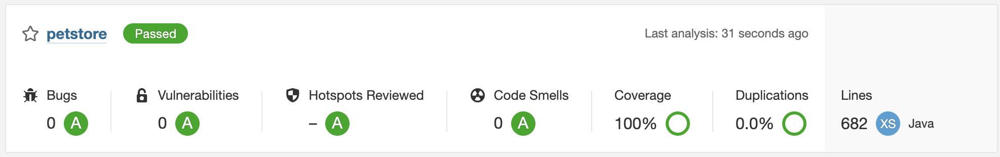
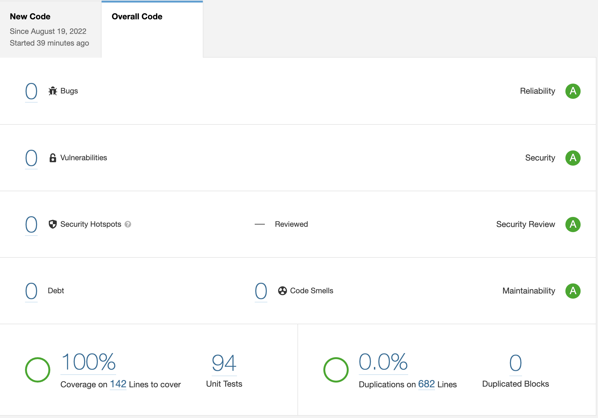
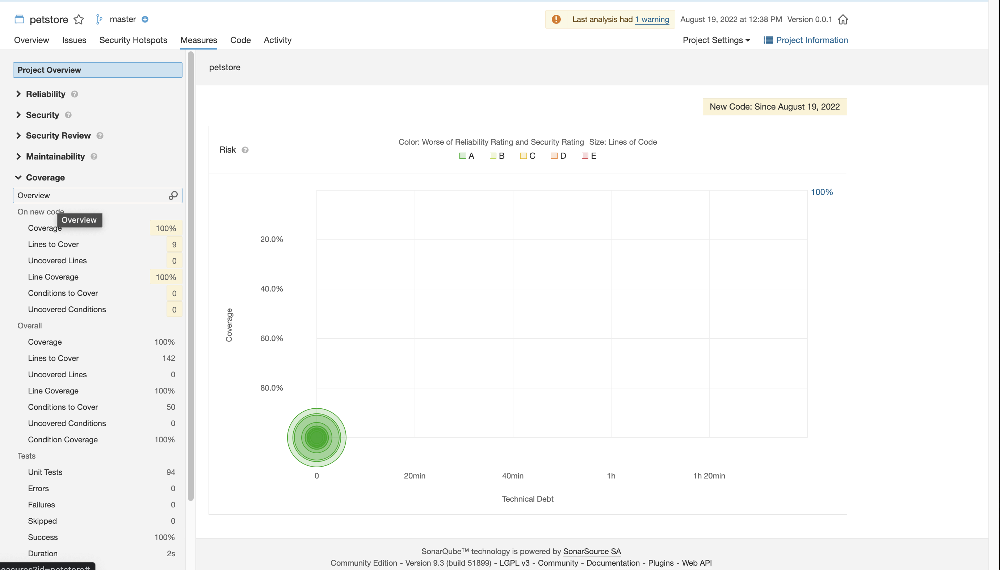

== Sonarqube Reports

The Gradle Sonarqube plugin is included in the build.gradle file.
The Sonarqube report for the Pet Store example looks like this:

[#img-sonarqube-overview]
.Sonarqube: Summary Report for the Pet Store

[#img-sonarqube-overall-code]
.Sonarqube: Quality Overview for the Pet Store

[#img-sonarqube-code-measures]
.Sonarqube: Code Measure Report for the Pet Store

[NOTE]
====
When you add multiple endpoints to any project, for example,
adding endpoints for stores and owners in the pet store,
Sonarqube will report code smells caused by duplicate code.
All POJO's and EJB's created by MetaCode have the same instance
variables, so SonarQube reports (correctly) that these classes
are the same.  As the POJO's and EJB's are filled in with their
actual instance variables, this issue will resolve itself naturally.
====

== The Generated Code: A Deep Dive

This `tree` output shows the inventory of classes generated for the base project and the Pet resource. 

[%hardbreaks]
[literal]
.
├── README.adoc
├── build.gradle
├── gradle
│   ├── dependencies.gradle
│   ├── docker.gradle
│   ├── lint.gradle
│   ├── sonarqube.gradle
│   ├── spotless.gradle
│   ├── standard-setup.gradle
│   └── wrapper
│       ├── gradle-wrapper.jar
│       └── gradle-wrapper.properties
├── gradle.properties
├── gradlew
├── gradlew.bat
├── lombok.config
├── metacode.properties
├── mvc-tree.txt
├── settings.gradle
└── src
├── integration
│   └── java
│       └── acme
│           └── petstore
│               ├── ApplicationTests.java
│               ├── common
│               │   └── AbstractIntegrationTest.java
│               ├── database
│               │   ├── DatabaseInitFunction.java
│               │   └── pet
│               │       └── PetRepositoryIT.java
│               └── endpoint
│                   ├── pet
│                   │   ├── PetControllerIT.java
│                   │   ├── PetExceptionHandlingIT.java
│                   │   └── PetServiceIT.java
│                   └── root
│                       ├── RootControllerIT.java
│                       └── RootExceptionHandlingIT.java
├── main
│   ├── docker-compose
│   │   └── docker-compose.yaml
│   ├── java
│   │   └── acme
│   │       └── petstore
│   │           ├── Application.java
│   │           ├── advice
│   │           │   └── GlobalExceptionHandler.java
│   │           ├── common
│   │           │   └── SpringProfiles.java
│   │           ├── config
│   │           │   ├── DateTimeFormatConfiguration.java
│   │           │   ├── LocalDateConverter.java
│   │           │   ├── ProblemConfiguration.java
│   │           │   └── WebMvcConfiguration.java
│   │           ├── database
│   │           │   └── pet
│   │           │       ├── Pet.java
│   │           │       ├── PetEntity.java
│   │           │       ├── PetRepository.java
│   │           │       ├── PetTablePopulator.java
│   │           │       ├── converter
│   │           │       │   ├── PetEntityToPojoConverter.java
│   │           │       │   └── PetPojoToEntityConverter.java
│   │           │       └── predicate
│   │           │           └── PetWithText.java
│   │           ├── endpoint
│   │           │   ├── pet
│   │           │   │   ├── PetController.java
│   │           │   │   ├── PetRoutes.java
│   │           │   │   └── PetService.java
│   │           │   └── root
│   │           │       ├── RootController.java
│   │           │       └── RootService.java
│   │           ├── exception
│   │           │   └── UnprocessableEntityException.java
│   │           ├── math
│   │           │   └── SecureRandomSeries.java
│   │           ├── trait
│   │           │   └── ResourceIdTrait.java
│   │           └── validation
│   │               ├── Alphabetic.java
│   │               ├── AlphabeticValidator.java
│   │               ├── OnCreate.java
│   │               ├── OnUpdate.java
│   │               ├── ResourceId.java
│   │               ├── ResourceIdValidator.java
│   │               ├── SearchText.java
│   │               └── SearchTextValidator.java
│   └── resources
│       ├── ValidationMessages.properties
│       └── application.properties
├── test
│   ├── java
│   │   └── acme
│   │       └── petstore
│   │           ├── advice
│   │           │   └── GlobalExceptionHandlerTests.java
│   │           ├── config
│   │           │   └── LocalDateConverterTests.java
│   │           ├── database
│   │           │   └── pet
│   │           │       ├── PetEntityTests.java
│   │           │       ├── converter
│   │           │       │   ├── PetEntityToPojoConverterTests.java
│   │           │       │   └── PetPojoToEntityConverterTests.java
│   │           │       └── predicate
│   │           │           └── PetWithTextTest.java
│   │           ├── endpoint
│   │           │   ├── pet
│   │           │   │   ├── FakeConversionService.java
│   │           │   │   ├── PetControllerTests.java
│   │           │   │   └── PetServiceTests.java
│   │           │   └── root
│   │           │       ├── RootControllerTest.java
│   │           │       └── RootServiceTest.java
│   │           ├── math
│   │           │   └── SecureRandomSeriesTests.java
│   │           └── validation
│   │               ├── AlphabeticValidatorTests.java
│   │               ├── ResourceIdValidatorTests.java
│   │               └── SearchTextValidatorTests.java
│   └── resources
│       └── application-test.yaml
└── testFixtures
    └── java
        └── acme
            └── petstore
                └── database
                    └── pet
                        ├── PetEntityTestFixtures.java
                        └── PetTestFixtures.java

55 directories, 77 files

=== What Are All These Files?

Some of the generated files are self-explanatory for those with
any Spring or Java experience. The less obvious files are
described here.

.Gradle Directory Content
|===
|File|Description

|dependencies.gradle|the inventory of third party libraries used
|docker.gradle|the JIB plugin's configuration, which affects the building of Docker files
|lint.gradle|lint configuration for the Java compiler
|sonarqube.gradle|SonarQube configuration
|spotless.gradle|Spotless code formatter configuration
|standard-setup.gradle|imports the other Gradle scripts into a single file
|===

.The Pet Package Content
|===
|File|Description

|Pet.java|The POJO representing the Pet entity
|PetEntity.java|The EJB for the Pet entity
|PetRepository.java|The JPA Repository for Pet entities
|PetEntityToPojoConverter.java|Converts a Pet EJB into a POJO
|PetPojoToEntityConverter.java|Converts a Pet POJO into an EJB
|PetController.java|Handles HTTP requests and responses
|PetRoutes.java|Defines various URLs for Pets
|PetService.java|Implements the business logic
|===
